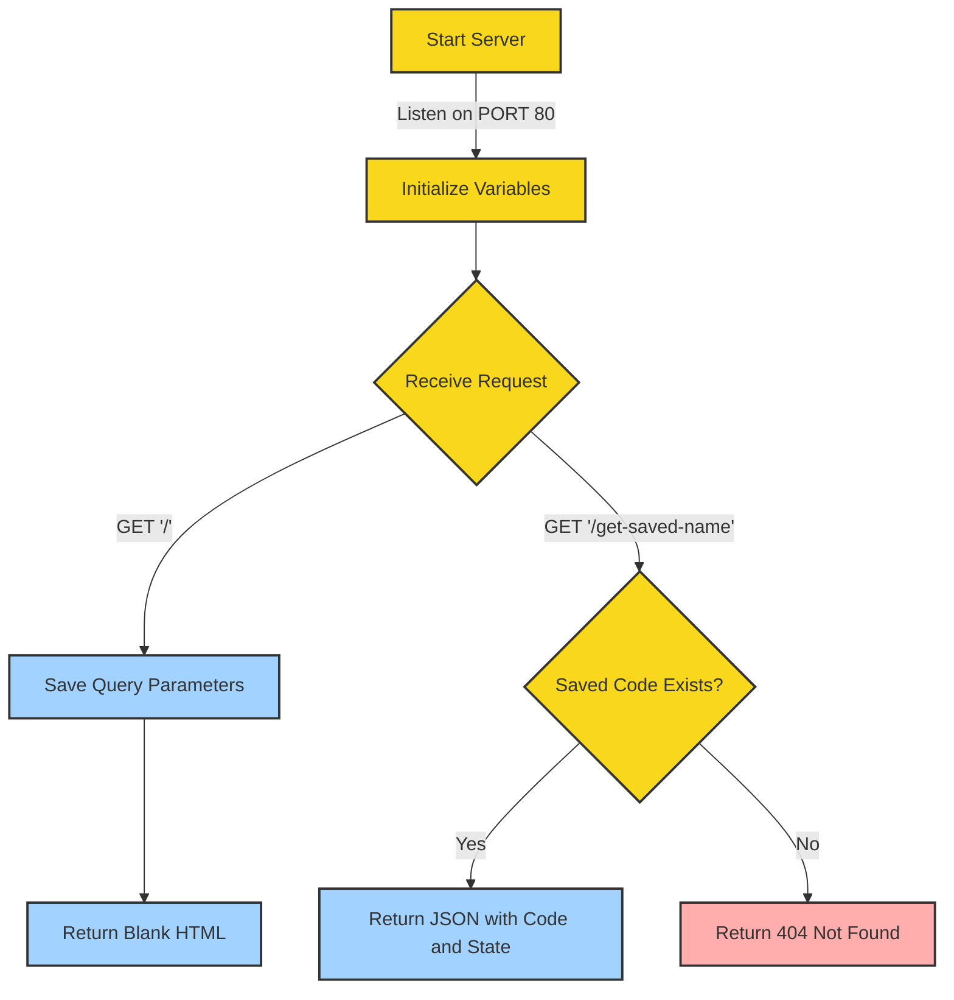

# <h1 align="center"><a href="https://github.com/ronknight/app-js">📱 Express.js Query Parameter Saver</a></h1>
<h4 align="center">A simple Express.js application that saves and retrieves query parameters.
</h4>

<p align="center">
<a href="https://twitter.com/PinoyITSolution"></a>
<a href="https://github.com/ronknight?tab=followers"></a>
<a href="https://github.com/ronknight/ronknight/stargazers"></a>
<a href="https://github.com/ronknight/ronknight/network/members"></a>
<a href="https://youtube.com/@PinoyITSolution"></a>
<a href="https://github.com/ronknight/app-js/issues"></a>
<a href="https://github.com/ronknight/app-js/blob/master/LICENSE"></a>
<a href="#"></a>
<a href="https://github.com/ronknight"></a>
</p>

<p align="center">
<a href="#requirements">📋 Requirements</a> •
<a href="#usage">🚀 Usage</a> •
<a href="#endpoints">🛣️ Endpoints</a> •
<a href="#script">📜 Script</a> •
<a href="#visualization">🔍 Visualization</a> •
<a href="#disclaimer">⚠️ Disclaimer</a>
</p>

---

## 📋 Requirements

- Node.js
- Express.js

## 🚀 Usage

1. Clone the repository:
   ```
   git clone https://github.com/ronknight/app-js.git
   ```
2. Install dependencies:
   ```
   npm install
   ```
3. Run the server:
   ```
   node app.js
   ```
4. The server will start running on `http://localhost:80`

## 🛣️ Endpoints

1. 🌐 **/** (GET)
   - Saves the `code` and `state` query parameters
   - Returns a blank HTML page

2. 🔍 **/get-saved-name** (GET)
   - Retrieves the saved `code` and `state` parameters
   - Returns a JSON object with the saved values

## 📜 Script

The `app.js` script sets up an Express.js server that:

- 💾 Saves `code` and `state` query parameters from the root endpoint
- 🔒 Stores these values in memory
- 🔍 Provides an endpoint to retrieve the saved values

## 🔍 Visualization

Here's a flow chart that visualizes the structure and flow of the application:




This flow chart illustrates:
- The server start and initialization process
- How requests are handled for different endpoints
- The logic flow for saving and retrieving parameters
- Success and error states

Color coding:
- Yellow: Main flow and decision points
- Light Blue: Successful operations
- Light Red: Error state

## ⚠️ Disclaimer

This application is for demonstration purposes only. In a production environment, consider:

- 🔐 Implementing proper security measures
- 💽 Using a database for persistent storage
- 🧪 Adding error handling and input validation

---

Made with ❤️ by [Ronknight](https://github.com/ronknight)